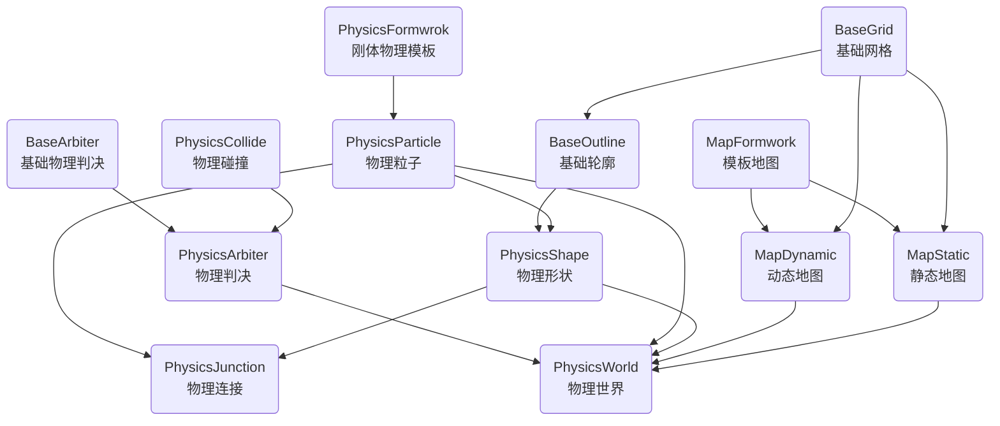

BaseStruct 数据结构体
BaseDefine 常量
BaseCalculate 基本计算函数

BaseArbiter 基础物理判决
PhysicsArbiter 物理判决
PhysicsCollide 物理碰撞

PhysicsShape 物理形状
PhysicsParticle 物理粒子
BaseGrid 基础网格
BaseOutline 基础轮廓

MapFormwork 模板地图
MapStatic 静态地图
MapDynamic 动态地图

PhysicsFormwrok 刚体物理模板

PhysicsJunction 物理连接

PhysicsWorld 物理世界

