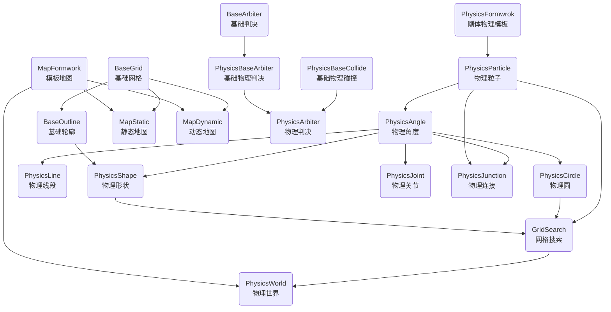

BaseStruct 数据结构体
BaseDefine 常量
BaseCalculate 基本计算函数

BaseArbiter 基础判决
PhysicsArbiter 物理判决
PhysicsBaseArbiter 基础物理判决
PhysicsBaseCollide 基础物理碰撞

PhysicsParticle 物理粒子
PhysicsAngle 物理角度
PhysicsCircle 物理圆
PhysicsLine 物理线段
PhysicsShape 物理形状
BaseGrid 基础网格
BaseOutline 基础轮廓

MapFormwork 模板地图
MapStatic 静态地图
MapDynamic 动态地图

PhysicsFormwrok 刚体物理模板

PhysicsJoint 物理关节
PhysicsJunction 物理连接

PhysicsWorld 物理世界
GridSearch 网格搜索

