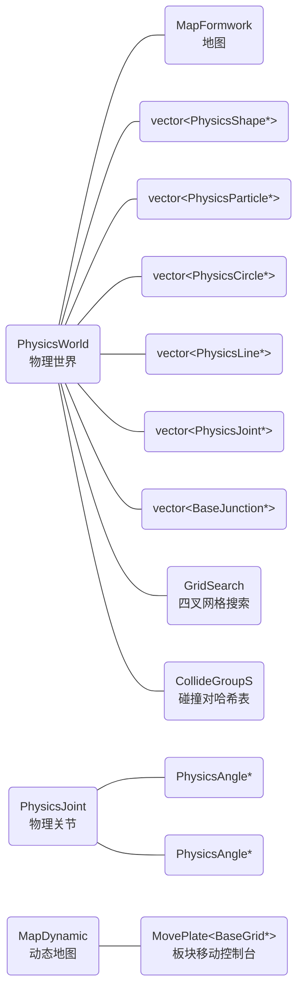
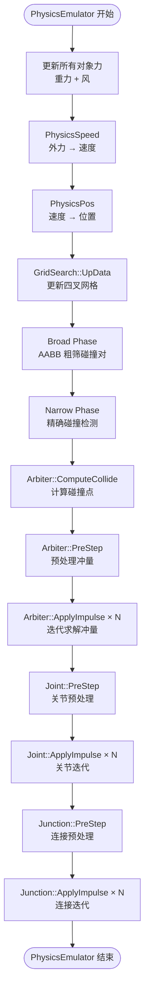

# PhysicsBlock

基于像素网格的 2D 刚体物理引擎，支持多种物理对象（网格形状、粒子、圆、线段）、关节约束、绳索连接、静态/动态地图碰撞检测，以及基于四叉树的网格搜索加速。

---

## 类继承关系

```mermaid
graph TD

    BaseSerialization(BaseSerialization<br/>JSON序列化基类)
    BaseGrid(BaseGrid<br/>基础网格)
    BaseOutline(BaseOutline<br/>基础轮廓)
    MapStatic(MapStatic<br/>静态地图)
    MapDynamic(MapDynamic<br/>动态地图)
    MapFormwork(MapFormwork<br/>地图模板接口)

    PhysicsFormwork(PhysicsFormwork<br/>刚体物理模板)
    PhysicsParticle(PhysicsParticle<br/>物理粒子)
    PhysicsAngle(PhysicsAngle<br/>物理角度)
    PhysicsCircle(PhysicsCircle<br/>物理圆)
    PhysicsLine(PhysicsLine<br/>物理线段)
    PhysicsShape(PhysicsShape<br/>物理形状)

    BaseArbiter(BaseArbiter<br/>碰撞裁决基类)
    PhysicsBaseArbiterAA(PhysicsBaseArbiterAA<br/>Angle↔Angle)
    PhysicsBaseArbiterAD(PhysicsBaseArbiterAD<br/>Angle↔Particle)
    PhysicsBaseArbiterA(PhysicsBaseArbiterA<br/>Angle↔地图)
    PhysicsBaseArbiterD(PhysicsBaseArbiterD<br/>Particle↔地图)
    PhysicsArbiterSS(PhysicsArbiterSS<br/>Shape↔Shape)
    PhysicsArbiterSP(PhysicsArbiterSP<br/>Shape↔Particle)
    PhysicsArbiterCS(PhysicsArbiterCS<br/>Circle↔Shape)
    PhysicsArbiterCC(PhysicsArbiterCC<br/>Circle↔Circle)
    PhysicsArbiterCP(PhysicsArbiterCP<br/>Circle↔Particle)
    PhysicsArbiterLC(PhysicsArbiterLC<br/>Line↔Circle)
    PhysicsArbiterLS(PhysicsArbiterLS<br/>Line↔Shape)
    PhysicsArbiterLP(PhysicsArbiterLP<br/>Line↔Particle)
    PhysicsArbiterS(PhysicsArbiterS<br/>Shape↔地图)
    PhysicsArbiterP(PhysicsArbiterP<br/>Particle↔地图)
    PhysicsArbiterC(PhysicsArbiterC<br/>Circle↔地图)
    PhysicsArbiterL(PhysicsArbiterL<br/>Line↔地图)

    BaseJunction(BaseJunction<br/>连接约束基类)
    PhysicsJunctionSS(PhysicsJunctionSS<br/>Angle↔Angle)
    PhysicsJunctionS(PhysicsJunctionS<br/>Angle↔固定点)
    PhysicsJunctionP(PhysicsJunctionP<br/>Particle↔固定点)
    PhysicsJunctionPP(PhysicsJunctionPP<br/>Particle↔Particle)

    PhysicsJoint(PhysicsJoint<br/>物理关节)
    GridSearch(GridSearch<br/>四叉网格搜索)
    PhysicsWorld(PhysicsWorld<br/>物理世界)

    BaseSerialization --> BaseGrid
    BaseGrid --> BaseOutline
    BaseGrid --> MapStatic
    MapFormwork -.-> MapStatic
    BaseGrid --> MapDynamic
    MapFormwork -.-> MapDynamic

    PhysicsFormwork --> PhysicsParticle
    BaseSerialization -.-> PhysicsParticle
    PhysicsParticle --> PhysicsAngle
    PhysicsAngle --> PhysicsCircle
    PhysicsAngle --> PhysicsLine
    BaseOutline --> PhysicsShape
    PhysicsAngle --> PhysicsShape

    BaseArbiter --> PhysicsBaseArbiterAA
    BaseArbiter --> PhysicsBaseArbiterAD
    BaseArbiter --> PhysicsBaseArbiterA
    BaseArbiter --> PhysicsBaseArbiterD
    PhysicsBaseArbiterAA --> PhysicsArbiterSS
    PhysicsBaseArbiterAA --> PhysicsArbiterCS
    PhysicsBaseArbiterAA --> PhysicsArbiterCC
    PhysicsBaseArbiterAA --> PhysicsArbiterLC
    PhysicsBaseArbiterAA --> PhysicsArbiterLS
    PhysicsBaseArbiterAD --> PhysicsArbiterSP
    PhysicsBaseArbiterAD --> PhysicsArbiterCP
    PhysicsBaseArbiterAD --> PhysicsArbiterLP
    PhysicsBaseArbiterA --> PhysicsArbiterS
    PhysicsBaseArbiterA --> PhysicsArbiterC
    PhysicsBaseArbiterA --> PhysicsArbiterL
    PhysicsBaseArbiterD --> PhysicsArbiterP

    BaseJunction --> PhysicsJunctionSS
    BaseJunction --> PhysicsJunctionS
    BaseJunction --> PhysicsJunctionP
    BaseJunction --> PhysicsJunctionPP
```

> 实线箭头 `-->` 表示继承，虚线箭头 `-.->` 表示接口实现

---

## 组合关系

```mermaid
graph LR

    PhysicsWorld(PhysicsWorld<br/>物理世界)
    MapFormwork(MapFormwork<br/>地图)
    PhysicsShapeS(vector&lt;PhysicsShape*&gt;)
    PhysicsParticleS(vector&lt;PhysicsParticle*&gt;)
    PhysicsCircleS(vector&lt;PhysicsCircle*&gt;)
    PhysicsLineS(vector&lt;PhysicsLine*&gt;)
    PhysicsJointS(vector&lt;PhysicsJoint*&gt;)
    BaseJunctionS(vector&lt;BaseJunction*&gt;)
    GridSearch(GridSearch<br/>四叉网格搜索)
    CollideGroupS(CollideGroupS<br/>碰撞对哈希表)

    PhysicsWorld --- MapFormwork
    PhysicsWorld --- PhysicsShapeS
    PhysicsWorld --- PhysicsParticleS
    PhysicsWorld --- PhysicsCircleS
    PhysicsWorld --- PhysicsLineS
    PhysicsWorld --- PhysicsJointS
    PhysicsWorld --- BaseJunctionS
    PhysicsWorld --- GridSearch
    PhysicsWorld --- CollideGroupS

    PhysicsJoint(PhysicsJoint<br/>物理关节)
    Angle1(PhysicsAngle*)
    Angle2(PhysicsAngle*)
    PhysicsJoint --- Angle1
    PhysicsJoint --- Angle2

    MapDynamic(MapDynamic<br/>动态地图)
    MovePlate(MovePlate&lt;BaseGrid*&gt;<br/>板块移动控制台)
    MapDynamic --- MovePlate
```

---

## 仿真流程

```mermaid
flowchart TD

    START([PhysicsEmulator 开始]) --> Speed[更新所有对象力<br/>重力 + 风]
    Speed --> PhysicsSpeed[PhysicsSpeed<br/>外力 → 速度]
    PhysicsSpeed --> PhysicsPos[PhysicsPos<br/>速度 → 位置]
    PhysicsPos --> GridUpdate[GridSearch::UpData<br/>更新四叉网格]
    GridUpdate --> BroadPhase[Broad Phase<br/>AABB 粗筛碰撞对]
    BroadPhase --> NarrowPhase[Narrow Phase<br/>精确碰撞检测]
    NarrowPhase --> ComputeCollide[Arbiter::ComputeCollide<br/>计算碰撞点]
    ComputeCollide --> PreStep[Arbiter::PreStep<br/>预处理冲量]
    PreStep --> ApplyImpulse[Arbiter::ApplyImpulse × N<br/>迭代求解冲量]
    ApplyImpulse --> JointPreStep[Joint::PreStep<br/>关节预处理]
    JointPreStep --> JointApply[Joint::ApplyImpulse × N<br/>关节迭代]
    JointApply --> JunctionPreStep[Junction::PreStep<br/>连接预处理]
    JunctionPreStep --> JunctionApply[Junction::ApplyImpulse × N<br/>连接迭代]
    JunctionApply --> END([PhysicsEmulator 结束])
```

---

## 类详细介绍

### 基础设施

| 类/文件 | 说明 |
|---------|------|
| **BaseDefine.h** | 编译期常量：转动惯量采样密度(5)、像素块边长(16)、能量转换率(0.9994)、最低迭代次数(10) |
| **BaseStruct.hpp** | 核心类型：`FLOAT_`/`Vec2_`/`Mat2_`(可切换float/double)、`GridBlock`(格子信息)、`Contact`(碰撞点)、`PhysicsObjectEnum`(对象类型枚举) |
| **BaseCalculate** | 数学工具：向量旋转(`vec2angle`)、可复用旋转矩阵(`AngleMat`)、Bresenham线段检测、莫顿码(`Morton2D`)、力分解、扭矩计算 |
| **BaseSerialization** | JSON序列化基类，通过宏 `SerializationInherit_` 条件继承，提供 `JsonSerialization()`/`JsonContrarySerialization()` 虚函数 |

### 网格与地图

| 类 | 继承 | 说明 |
|----|------|------|
| **BaseGrid** | BaseSerialization | 基础网格，管理 `GridBlock` 二维数组，提供 `at()` 访问和 `BresenhamDetection()` 线段碰撞检测 |
| **BaseOutline** | BaseGrid | 外轮廓点集合，`UpdateOutline()` 计算形状外轮廓点坐标(相对质心)，`UpdateLightweightOutline()` 轻量版 |
| **MapFormwork** | 接口 | 地图模板接口：`FMGetCollide()`、`FMBresenhamDetection()`、`FMGetGridBlock()` |
| **MapStatic** | BaseGrid + MapFormwork | 静态地图，`centrality` 中心偏移，`GetOutline()` 获取区域轮廓，带线段裁剪的碰撞检测 |
| **MapDynamic** | MapFormwork + BaseGrid | 动态地图，使用 `MovePlate<BaseGrid*>` 实现无限滚动，莫顿码优化板块内存布局 |
| **MovePlate** | 模板工具类 | 板块移动控制台，管理二维板块数组，支持按位置偏移滚动和生成/销毁回调 |

### 物理对象

| 类 | 继承 | 说明 |
|----|------|------|
| **PhysicsFormwork** | 接口 | 动态物体统一接口：`PhysicsSpeed()`、`PhysicsPos()`、`PFGetType()`、`PFGetCollisionR()` 等 |
| **PhysicsParticle** | PhysicsFormwork + BaseSerialization | 物理粒子：位置、速度、受力、质量/质量倒数、摩擦因数、静止计数器。`invMass=0` 表示不可移动 |
| **PhysicsAngle** | PhysicsParticle | 可旋转粒子：增加转动惯量、角度、角速度、扭矩、碰撞半径。`AddForce(Pos, Force)` 同时影响移动和旋转 |
| **PhysicsShape** | PhysicsAngle + BaseOutline | 网格形状：质心/几何中心、`UpdateAll()` 更新物理信息+轮廓+碰撞半径、`DropCollision()` 点击检测、`PsBresenhamDetection()` 旋转线段碰撞 |
| **PhysicsCircle** | PhysicsAngle | 物理圆：转动惯量 `I = 0.5mr²`，碰撞半径即圆半径 |
| **PhysicsLine** | PhysicsAngle | 物理线段：位置为中点，角度为方向，转动惯量 `I = L²m/12`，碰撞半径为半长 |

### 碰撞裁决

| 类 | 继承 | 说明 |
|----|------|------|
| **BaseArbiter** | BaseSerialization | 碰撞裁决基类：`Contact contacts[20]` 碰撞点集合、`ArbiterKey` 碰撞对键、`ComputeCollide()`/`PreStep()`/`ApplyImpulse()` 纯虚函数 |
| **PhysicsBaseArbiterAA** | BaseArbiter | Angle ↔ Angle 裁决中间类 |
| **PhysicsBaseArbiterAD** | BaseArbiter | Angle ↔ Particle 裁决中间类 |
| **PhysicsBaseArbiterA** | BaseArbiter | Angle ↔ 地图 裁决中间类 |
| **PhysicsBaseArbiterD** | BaseArbiter | Particle ↔ 地图 裁决中间类 |
| **PhysicsArbiter××** | 对应中间类 | 12种具体裁决：SS/SP/S/P/C/CS/CP/CC/LC/LS/LP/L |
| **PhysicsBaseCollide** | 纯函数 | 碰撞检测函数集：`CollideAABB()` 粗筛、`Collide()` 精确检测 |

### 约束

| 类 | 说明 |
|----|------|
| **PhysicsJoint** | 物理关节(铰接约束)，连接两个 PhysicsAngle，`Set()` 设置铰接点，迭代求解维持相对位置 |
| **BaseJunction** | 连接约束基类，支持4种绳索类型：`cord`(绳子,仅约束拉伸)、`rubber`(橡皮筋,弱约束)、`spring`(弹簧,双向约束)、`lever`(杠杆,刚性) |
| **PhysicsJunctionSS** | Angle ↔ Angle 连接 |
| **PhysicsJunctionS** | Angle ↔ 固定点 连接 |
| **PhysicsJunctionP** | Particle ↔ 固定点 连接 |
| **PhysicsJunctionPP** | Particle ↔ Particle 连接 |

### 搜索与优化

| 类 | 说明 |
|----|------|
| **GridSearch** | 四叉网格搜索：按碰撞半径分配到不同层级网格，莫顿码优化空间局部性，`Get(pos, R)` 获取范围内对象，`UpData()` 更新网格位置 |
| **EnergyConservation** | 动能守恒计算：粒子间理想碰撞、形状间碰撞(同时计算线速度和角速度变化) |

### 世界

| 类 | 说明 |
|----|------|
| **PhysicsWorld** | 物理世界：管理所有对象和仿真流程。持有5种对象容器、12个碰撞裁决内存池、线程池。`PhysicsEmulator(time)` 仿真主循环、`Get(pos)` 获取位置上对象、`GetWorldEnergy()` 获取总动能 |

### 调试

| 类/文件 | 说明 |
|---------|------|
| **ImGuiPhysics** | ImGui调试界面：各类型对象属性编辑器、辅助视觉参数控制(位置/速度/受力/质心/外骨骼/碰撞点等开关与颜色)、INI持久化 |

---

## 文件索引

| 文件 | 分类 | 说明 |
|------|------|------|
| `BaseDefine.h` | 基础 | 编译期常量 |
| `BaseStruct.hpp` | 基础 | 核心类型与数据结构 |
| `BaseCalculate.hpp/.cpp` | 基础 | 数学计算函数集 |
| `BaseSerialization.hpp` | 基础 | JSON序列化基础设施 |
| `BaseGrid.hpp/.cpp` | 网格 | 基础网格类 |
| `BaseOutline.hpp/.cpp` | 网格 | 外轮廓点集合 |
| `MapFormwork.hpp` | 地图 | 地图模板接口 |
| `MapStatic.hpp/.cpp` | 地图 | 静态地图 |
| `MapDynamic.hpp/.cpp` | 地图 | 动态地图 |
| `MovePlate.h` | 地图 | 板块移动控制台模板 |
| `PhysicsFormwork.hpp` | 对象 | 动态物体接口 |
| `PhysicsParticle.hpp/.cpp` | 对象 | 物理粒子 |
| `PhysicsAngle.hpp/.cpp` | 对象 | 物理角度 |
| `PhysicsShape.hpp/.cpp` | 对象 | 网格形状 |
| `PhysicsCircle.hpp/.cpp` | 对象 | 物理圆形 |
| `PhysicsLine.hpp/.cpp` | 对象 | 物理线段 |
| `BaseArbiter.hpp` | 碰撞 | 碰撞裁决基类 |
| `PhysicsBaseArbiter.hpp/.cpp` | 碰撞 | 裁决中间类(AA/AD/A/D) |
| `PhysicsArbiter.hpp/.cpp` | 碰撞 | 12种具体裁决类 |
| `PhysicsBaseCollide.hpp/.cpp` | 碰撞 | 碰撞检测函数集 |
| `PhysicsJoint.hpp/.cpp` | 约束 | 物理关节 |
| `PhysicsJunction.hpp/.cpp` | 约束 | 连接约束(4种) |
| `EnergyConservation.hpp` | 优化 | 动能守恒计算 |
| `GridSearch.hpp` | 优化 | 四叉网格搜索 |
| `PhysicsWorld.hpp/.cpp` | 世界 | 物理世界 |
| `ImGuiPhysics.hpp/.cpp` | 调试 | ImGui调试界面 |
