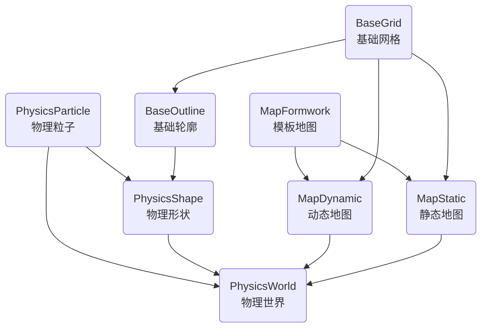

BaseStruct 数据结构体
BaseDefine 常量
BaseCalculate 基本计算函数

PhysicsShape 物理形状
PhysicsParticle 物理粒子
BaseGrid 基础网格
BaseOutline 基础轮廓

MapFormwork 模板地图
MapStatic 静态地图
MapDynamic 动态地图

PhysicsJunction 物理连接

PhysicsWorld 物理世界

